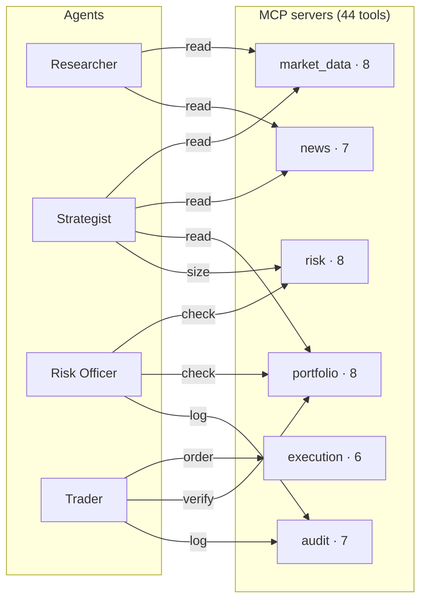

# Autonomous Multi-Agent Trading Floor

A simulated trading floor where four collaborating agents — **Researcher**,
**Strategist**, **Risk Officer**, **Trader** — independently research the
market, propose trades, vet them against risk limits, and execute against a
simulated portfolio with a full audit trail.

Tools are exposed through **6 MCP servers** (44 tools total) that the agents
discover at runtime. **CrewAI** drives the collaborative research stage;
**LangGraph** orchestrates the broader state machine, including the per-cycle
risk review and execution loop.

## Architecture



The orchestrator is a LangGraph state machine:

```
START -> gather_context -> research_crew (CrewAI: R + S)
                            -> review_risk (one pass per proposal)
                              -> execute_trades (only on approved)
                                -> close_cycle -> {next_cycle | END}
```

State is shared across nodes via a `TypedDict` with an additive reducer on
`executed_orders`, so multiple cycles' fills accumulate into the same channel.

## Why this design

- **MCP as the tool boundary.** Tools live behind 6 standalone MCP servers,
  each owning a single concern (market data, news, portfolio, execution,
  risk, audit). Any MCP-aware client can connect — the agents in this repo
  are just one such client. Servers can be deployed independently.
- **CrewAI for collaboration; LangGraph for control flow.** The Researcher
  and Strategist genuinely produce and consume each other's artifacts, which
  is exactly what CrewAI is designed for. The cycle-level state machine —
  conditional branches, multi-cycle loops, parallel-friendly reducers — is
  what LangGraph is good at. Each tool is used where it shines.
- **Simulated execution is real execution.** Orders go through a full
  matching path: limit-vs-mark check, cash-vs-shares validation, fills
  written atomically with position and cash updates, P&L booked. Swap the
  execution server for a broker adapter and the rest of the system is
  unchanged.
- **Every action is auditable.** Decisions, fills, and cycle events all flow
  through the audit server into SQLite. The CLI's `audit` command and the
  Gradio UI both read from the same store.

## Project layout

```
trading-floor/
├── app.py                         # Gradio UI
├── pyproject.toml
├── src/trading_floor/
│   ├── cli.py                     # `trading-floor` CLI
│   ├── config.py                  # env-driven Settings
│   ├── prompts.py                 # System prompts for the 4 agents
│   ├── models.py                  # Pydantic models shared across the system
│   ├── state.py                   # LangGraph FloorState
│   ├── orchestrator.py            # LangGraph state machine
│   ├── mcp_client.py              # MultiServerMCPClient setup
│   ├── agents/                    # 4 agent factories
│   │   ├── researcher.py          #   CrewAI agent
│   │   ├── strategist.py          #   CrewAI agent
│   │   ├── risk_officer.py        #   LangGraph create_react_agent
│   │   └── trader.py              #   LangGraph create_react_agent
│   ├── crews/
│   │   └── research_crew.py       # CrewAI crew: Researcher -> Strategist
│   ├── servers/                   # 6 MCP servers, each runnable standalone
│   │   ├── market_data_server.py  #   8 tools
│   │   ├── news_server.py         #   7 tools
│   │   ├── portfolio_server.py    #   8 tools
│   │   ├── execution_server.py    #   6 tools
│   │   ├── risk_server.py         #   8 tools
│   │   └── audit_server.py        #   7 tools
│   ├── data/                      # Synthetic market + news generators
│   │   ├── universe.py
│   │   ├── market_store.py
│   │   └── news_store.py
│   └── storage/                   # SQLite-backed persistence
│       ├── db.py
│       ├── portfolio_repo.py
│       └── audit_repo.py
└── tests/
```

## Quick start

```bash
# 1. Install
uv venv && source .venv/bin/activate
uv pip install -e ".[dev]"

# 2. Configure
cp .env.example .env
# add your OPENAI_API_KEY

# 3. Run a one-cycle session on a small watchlist
trading-floor trade --tickers "AAPL,MSFT,NVDA,JPM" --cycles 1

# Or launch the web UI
python app.py
```

Useful CLI subcommands:

```bash
trading-floor status                      # current portfolio
trading-floor audit --kind decision -n 30 # recent decisions
trading-floor audit --actor risk_officer  # filter by actor
trading-floor reset                       # wipe state, start fresh
```

The MCP servers can also be launched standalone (e.g., to plug them into
Claude Desktop or another MCP client):

```bash
tf-market-data-server
tf-news-server
tf-portfolio-server
tf-execution-server
tf-risk-server
tf-audit-server
```

## Configuration

| Variable | Default | Purpose |
| --- | --- | --- |
| `TF_RESEARCHER_MODEL` | `gpt-4o-mini` | Researcher LLM |
| `TF_STRATEGIST_MODEL` | `gpt-4o-mini` | Strategist LLM |
| `TF_RISK_MODEL` | `gpt-4o-mini` | Risk Officer LLM |
| `TF_TRADER_MODEL` | `gpt-4o-mini` | Trader LLM |
| `TF_STARTING_CASH` | `1000000` | Initial cash for the simulated account |
| `TF_PRICE_SEED` | `42` | Seed for synthetic prices (reproducible runs) |
| `TF_DATA_DIR` | `./runs` | Where SQLite DB and exports live |
| `TF_MAX_POSITION_PCT` | `20` | Per-name position cap as % of equity |
| `TF_MAX_SECTOR_PCT` | `40` | Per-sector exposure cap as % of equity |

## Tests

```bash
pytest
```

Tests cover:

- All 6 MCP servers register the expected tool counts (44 total).
- Portfolio bookkeeping (buys, sells, oversells rejected, limit orders).
- LangGraph orchestrator compiles with the expected nodes.
- Pydantic models round-trip cleanly.

No tests touch the network or the LLM.

## Roadmap

- Real market data adapter (Polygon, Alpaca) behind the same MCP boundary.
- Backtesting mode that replays a date range and scores agent performance.
- Multi-strategy mode where several strategist agents propose competing
  ideas and the Risk Officer adjudicates.
- Per-position trailing stops managed by a dedicated monitoring agent.

## License

MIT
